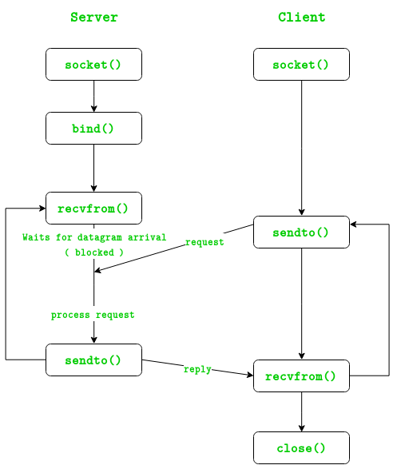

# UDP-Sockets-Example

In UDP, the client does not form a connection with the server like in TCP and instead just sends a datagram. Similarly, the server need not accept a connection and just waits for datagrams to arrive. Datagrams upon arrival contain the address of sender which the server uses to send data to the correct client.

**UDP Server:**

    1. Create UDP socket.
    2. Bind the socket to server address.
    3. Wait until datagram packet arrives from client.
    4. Process the datagram packet and send a reply to client.
    5. Go back to Step 3.
    
**UDP Client:**

    1. Create UDP socket.
    2. Send message to server.
    3. Wait until response from server is recieved.
    4. Process reply and go back to step 2, if necessary.
    5. Close socket descriptor and exit.